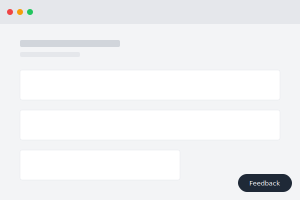
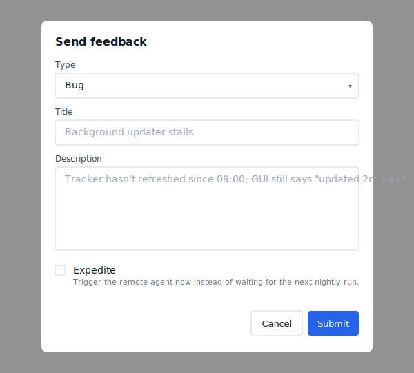

# feedback-kit

In-app feedback button (Bug/Feature, optional Expedite) that writes to `feedback.md` at the repo root. An optional scheduled agent reads the queue and opens PRs against the default branch.

Designed to be installed by a code-generation agent, not by hand.

## What it looks like

| Closed (button only)                 | Open (modal)                       |
| ------------------------------------ | ---------------------------------- |
|         |           |

Live preview: open [`preview/index.html`](preview/index.html) in a browser — the modal renders with the same JS that gets installed into your project, and the on-page controls let you toggle Expedite and edit the `toolName`.

## Install

In the repository containing your app, launch a code-generation agent (Claude Code, Codex, Cursor, Aider, etc.) and tell it:

> Implement this: `https://github.com/tighe-ecc/feedback-kit`

The agent runs through the procedure in [`DEPLOY.md`](DEPLOY.md):

1. **Read** this repo's docs end-to-end.
2. **Inspect** your project — stack, entry point, templates dir, static dir, hosting model, GitHub remote.
3. **Pick an adaptation** from [`adaptations/`](adaptations/) that matches your hosting/stack.
4. **Capture customizations.** Ask what you want changed from the defaults. Examples:
   - "Skip the Expedite checkbox — nightly cron only."
   - "Rename Bug/Feature to Issue/Idea."
   - "Put `feedback.md` under `docs/` instead of the repo root."
   - "Don't auto-commit and push `feedback.md`; I'll commit it manually."
5. **Present a written plan** — exact paths, exact patches, the adaptation in use, the customizations applied, plus a tailored preview (a customized copy of `preview/index.html` you can open in a browser to see the modal as it'll appear after install) — and wait for sign-off.
6. **Implement Capture** — button, receive endpoint, queue file — idempotently.
7. **Verify** end-to-end with a test submission.
8. **Offer the optional Agent loop**, walking you through registration on your preferred platform: Claude.ai routines, a GitHub Actions cron + LLM CLI, OpenAI Assistants + external scheduler, or self-hosted cron + LLM CLI.

## Two halves

- **Capture** — button + endpoint + `feedback.md`. Standalone-useful as a structured complaint board with provenance.
- **Agent loop** — scheduled agent that drains the queue into PRs. Optional; install later if you want.

## Files

| Path                            | Purpose                                                                          |
| ------------------------------- | -------------------------------------------------------------------------------- |
| [`CONCEPT.md`](CONCEPT.md)      | Concept, components, invariants, in/out of scope.                                |
| [`DEPLOY.md`](DEPLOY.md)        | Procedure the installing agent follows.                                          |
| [`reference/`](reference/)      | End-to-end implementation for FastAPI / Flask / Express, locally hosted.         |
| [`adaptations/`](adaptations/)  | Pattern docs for other hosting/stack shapes (remote, no-backend, novel stacks).  |
| [`automation/`](automation/)    | Optional scheduled-agent prompt template + platform notes.                       |
| [`preview/`](preview/)          | Static SVG renders + a live in-browser preview of the Feedback modal.            |
| [`skill/`](skill/)              | Optional Claude Code skill stub; delegates to `DEPLOY.md`.                       |

Working example: [`tighe-ecc/mailroom`](https://github.com/tighe-ecc/mailroom) uses the kit with Claude.ai routines.

## Manual install

Read `DEPLOY.md` and apply the steps yourself.

## Contributing

PRs welcome — especially for:

- Better prompts in `automation/routine-prompt.template.md`.
- Clearer or more accurate docs (`CONCEPT.md`, `DEPLOY.md`, the adaptation pattern files).
- New adaptations for hosting/stack shapes not yet covered.
- Fixes / refinements to `reference/` that downstream installs would benefit from.

Open a PR with the change and a one-line rationale. No issues / triage queue — if it's not worth a PR, it's noise.
